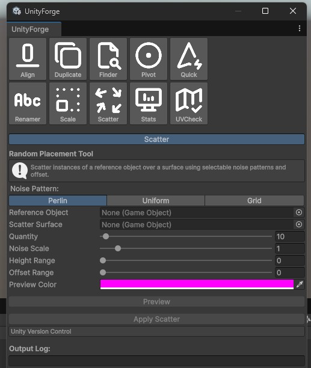

# UnityForge Toolkit

A lightweight set of modular editor tools for Unity – made for level designers, technical artists, and rapid prototyping.

  
  

  
  

##  Features
Object Tools
Object Finder Tool – Find and highlight all objects with a specific material or tag. Supports filtering, selection, and icon marking (currently without icons).
Quick Tool Access – Centralized launcher to quickly access any tool in the toolkit.

Transformation Tools
Align Tool – Align selected objects to surfaces or other objects.
Scale Tool – Batch scale selected objects with custom constraints.
Pivot Tool – Reposition the pivot of an object based on its bounding box.

Placement Tools
Scatter Tool – Randomly place objects on a target surface (RandomPlacementTool). Includes controls for density, noise, and rotation.

Rename & Utility Tools
Renamer Tool – Batch rename selected objects using search/replace patterns and numbering.
Duplicate Tool – Duplicate objects with spacing and alignment options.

Statistics & Optimization Tools
Stats Tool – Aggregate scene stats for common optimization targets.
DrawCall Stats Module – Count and inspect draw calls.
Geometry Stats Module – Triangle and vertex stats.
Lighting Stats Module – Lighting setup and bake stats.
Material Stats Module – Material usage overview.
Memory Stats Module – Rough memory footprint estimation.
Object Stats Module – Object count and grouping by type.
UV Checker Tool – Tool for inspecting UV layouts for selected meshes.

##  Structure
Assets/
└── UnityForge-Toolkit/
├── Editor/
│ ├── Tools/
│ ├── Windows/
│ └── Icons/

##  Requirements
Unity 6000.0.47f1 (tested)
No external dependencies

##  License
MIT – free to use, modify and distribute.

## Attribution

This project uses icon assets from [Tabler Icons](https://tabler.io/icons), licensed under the MIT License.

Copyright © 2021-present Paweł Kuna  
Permission is hereby granted, free of charge, to any person obtaining a copy of this software and associated documentation files...

The icons were adapted for use within the UnityForge Toolkit and may have been resized or exported to PNG format.

Full license text: https://github.com/tabler/tabler-icons/blob/main/LICENSE

